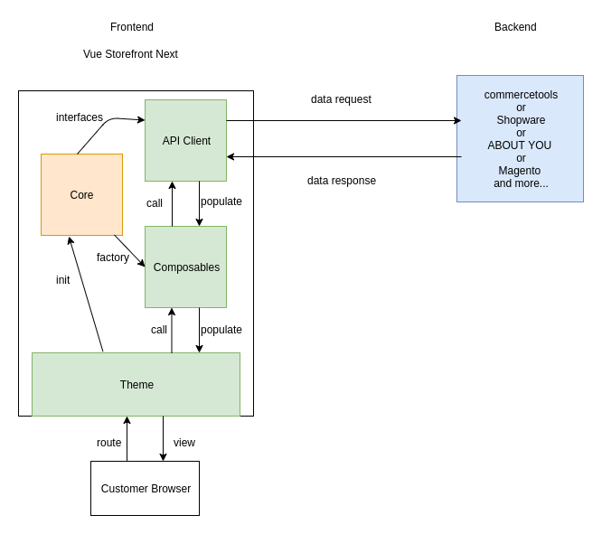

# Architecture

_Vue Storefront Next_ has been built upon the idea of _microservice architecture_, that is, also known as, including but not limited to _agnostic design_, _declarative protocol_, _modular packages_, and basically all the good things you can think of when it comes to software development. (It's not the one shot perfect solution, but let's focus on good things first)

Throughout the countless trials and errors, we have managed to come up with a better solution that fits the ideal structure we had aimed at with low coupling and high cohesion. (Still improving and it will never stop improving though)

We are going to talk about the underlying architecture of _Vue Storefront Next_ in this section including _Templates_, _API_, _Theme_, and other components with visual representation. 

[[toc]]

## Templates
All the integration have their own best practices and in case of _Vue Storefront Next_, we prepared _boilerplate_ template for the starting point. The `boilerplate` packages are the minimum template to guide your own integration. They consist of 3 individual packages; ___API client___, ___Composables___, and ___Theme___. 

This is the simple overview of how _Vue Storefront Next_ works. For an integration to fully work, you need to prepare those 3 packages in green, and _boilerplate_ packages are there for helping you start it as `boilerplate`, `boilerplate-api`, `boilerplate-theme` in `npm` package which is linked to `./packages/boilerplate` and its equivalent subfolder. 

## API
It is data layer (TBD)

## Theme
It is presentation layer (TBD)

## Composables
It is service layer that deals with business logic. (TBD)
